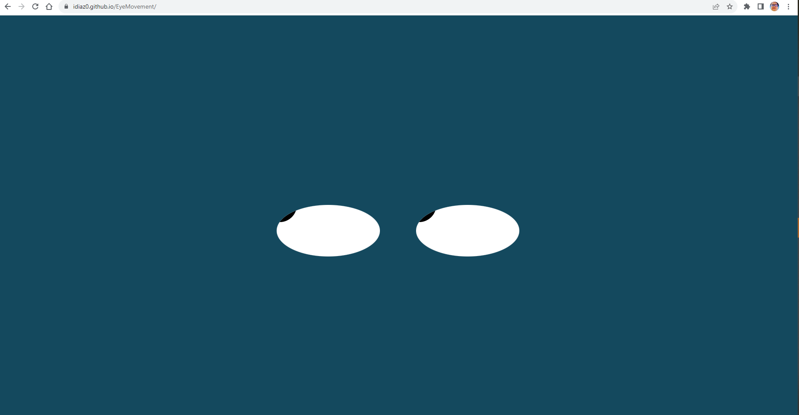

# idiaz0.github.io/Eye-Movement
<h1>This app was develop using javascript, html and css.</h1>
 
</img> 

This code basically is for funny. The variables can be used to move the rotation eyes and position.
Thi code basically is tracking the possition of the cursor pointer. The html DOM is generated automatically
by the javascript code

